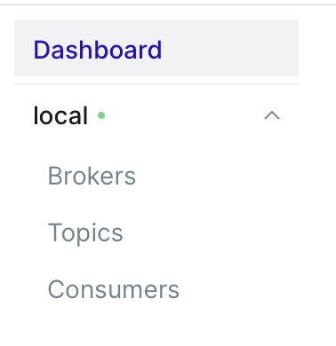
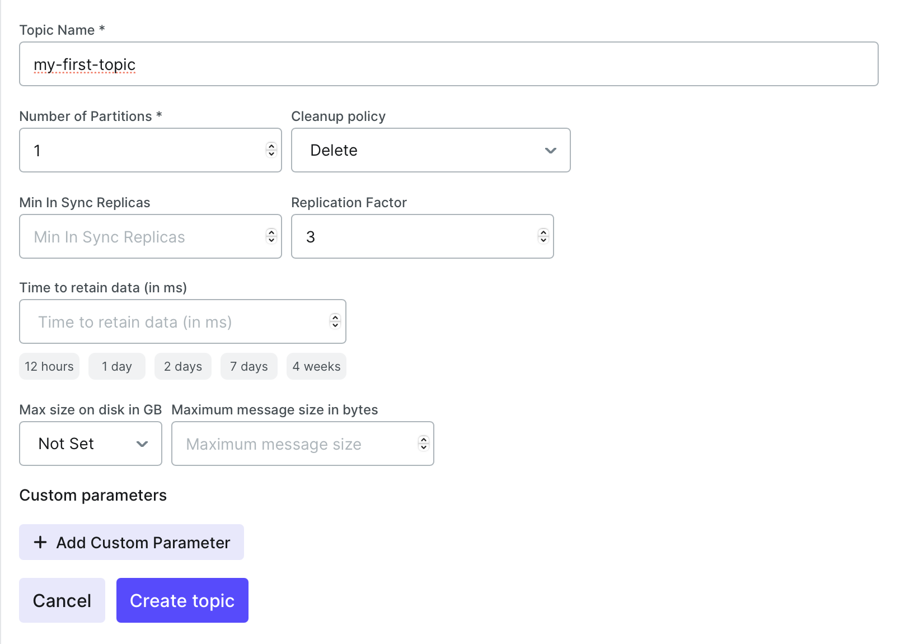
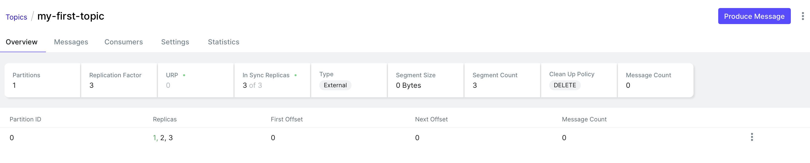
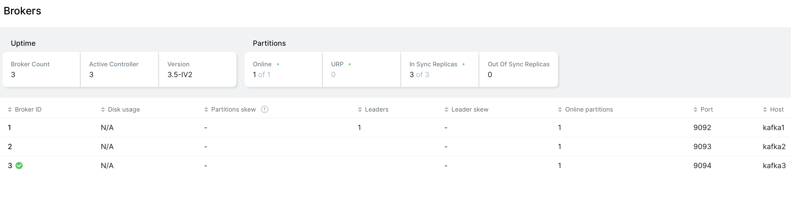
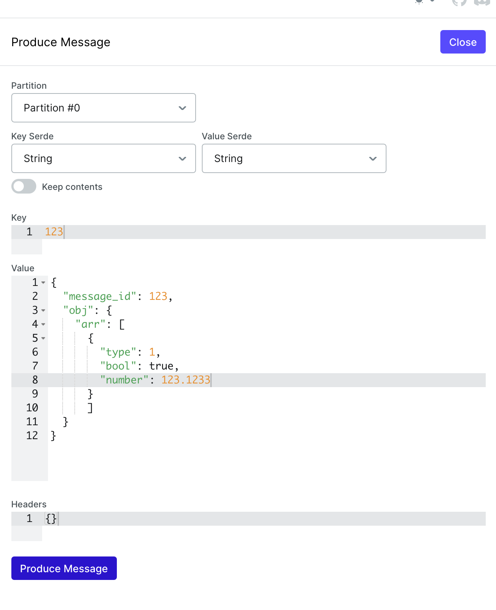

# Описание работы в Kafka-UI
## Разделы
В Kafka-UI четыре раздела:
* Брокеры
* Топики
* Консьюмеры
* Дашборд с кластерами  

### Дашборд с кластерами
Нас он не сильно интересует, поскольку под нашим управлением находится один кластер Apache Kafka.
Самое интересное – количество online и offline кластеров. Если вы видите, что кластер не online, значит что-то сломалось и стоит перезапустить docker-compose проект
### Топики
В разделе с топиками мы можем управлять топиками в нашем кластере Kafka
#### Создание топика
Для создания нажимаем Add a Topic

Во всплывающем окне заполняем параметры топика:
* Название топика
* Количество партиций
* Остальные параметры по желанию (в тч Custom Parameters)

* Теперь можно смотреть информацию о топике

### Брокеры
В брокерах можно посмотреть, кто является активным контроллером, сколько брокеров сейчас поднято и какой у них статус, какое количество партиций лидеров на каждом брокере

### Создание сообщений
Для создания сообщений нужно перейти в конкретный топик и нажать "Produce message"
Во всплывающем окне можно указать параметры сообщения и отправить его
