# Практическая работа Kafka
## Цель
* Освоить написание продьюсера и консьюмера
* Узнать, как различные параметры настройки влияют на работу с Kafka
## Выполнение
### Подготовительная часть
* Скачиваем [репозиторий по ссылке](https://github.com/ZValeriy/se_kafka_workshop)  
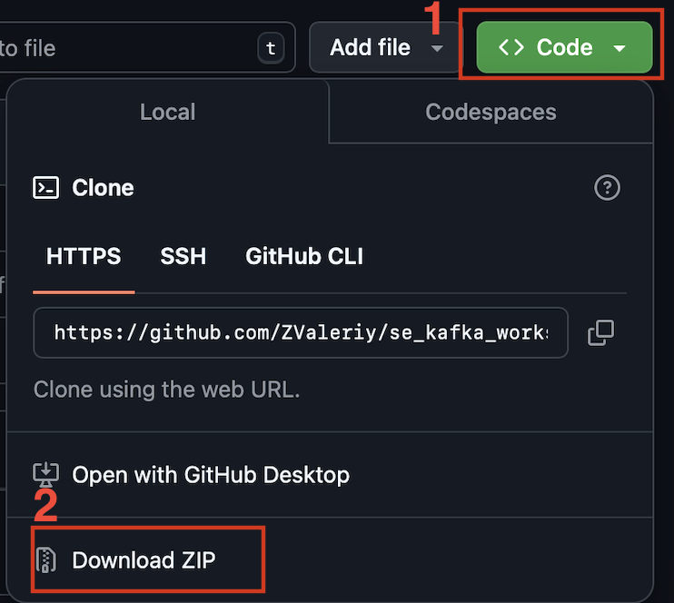
* Разархивируем репозиторий
* В содержимом несколько заготовок:
    * [Конфигурация docker-compose.](./docker-compose.yaml) Нужна для поднятия кластера Apache Kafka и RabbitMQ
    * [Jupyter-notebook с заготовкой для KafkaProducer](./kafka-producer.ipynb). В нём мы будем писать код для отправки сообщений
    * [Jupyter-notebook с заготовкой для KafkaConsumer](./kafka-consumer.ipynb). В нём мы будем писать код для получения и обработки сообщений
    * [Тестовый jupyter-notebook](./test.ipynb) для создания виртуального окружения и установки необходимых расширений
#### Установка ПО
##### VS Code
* Скачиваем [VS Code](https://code.visualstudio.com). Понадобится для работы с файлами с кодом и установки виртуального окружения
* Устанавливаем
##### Docker Desktop
* Скачиваем [Docker Desktop](https://www.docker.com). Нужен будет для работы с docker-compose проектом
#### Создание виртуального окружения
##### Установка расширения для Python
* Открываем вкладку "Расширения" (Extensions)
* В поиске вводим Python
* Ищем от Microsoft  
  
* Устанавливаем
##### Установка расширения для Jupyter
* Открываем вкладку "Расширения" (Extensions)
* В поиске вводим Jupyter
* Ищем от Microsoft  
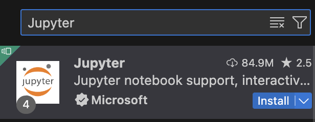
* Устанавливаем
##### Подготовка окружения
* Открываем [тестовый ноутбук](./test.ipynb)  
* Видим:
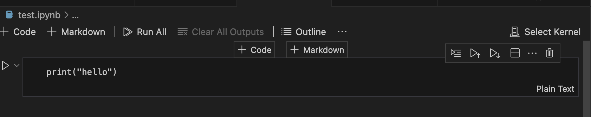  
* Жмём Select Kernel 
* Выбираем "Python environments"  
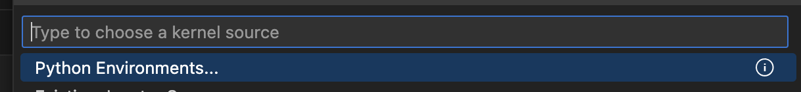   
* Выбираем "Create"  
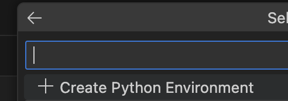  
* Выбираем "Venv"  
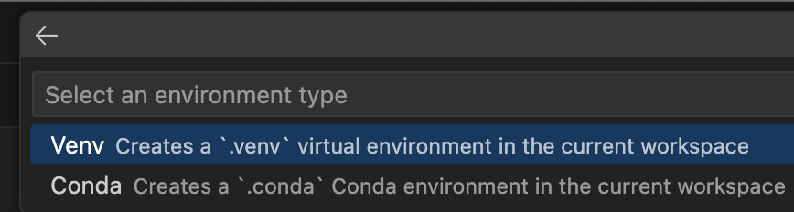  
* Выбираем установленный интерпретатор Python (любой)
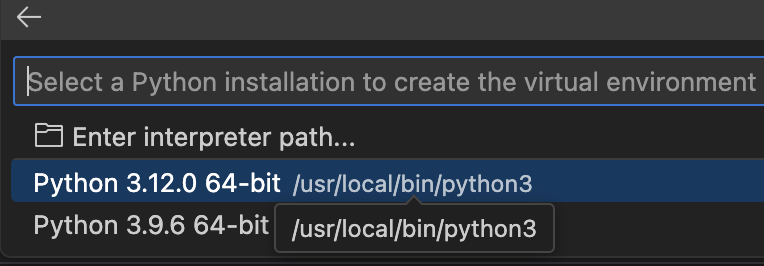  
* Спустя какое-то время создается виртуальное окружение
* Появляется папка .venv в той папке, где мы находимся
* Появлятся подсветка синтаксиса в ноутбуке  
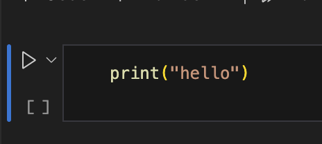  
* Можно запустить ячейку, нажав треугольник слева от ячейки или сочетание Shift + Enter
* Под ячейкой должно появиться "Hello"  
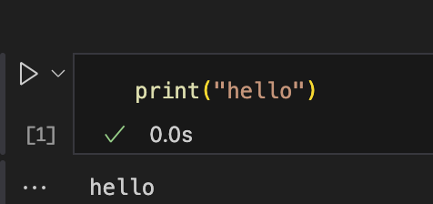  

Готово, в других .ipynb-файлах достаточно будет после нажатия на "Select Kernel" указать уже созданное окружение

### Основная часть работы
#### Запуск инструментов
* Запускаем Docker Desktop
* Открываем в VS Code папку с репозиторием (File -> Open Folder)
* Открываем терминал
    * Можно использовать встроенный системный
    * можно открыть терминал в VS Code (View -> Terminal или сочетание клавиш Ctrl+Shift+`)
* Проверяем, что Docker-Desktop работает, вводим в терминал команду
``` bash
docker --version
```
* В результате должны увидеть что-то вроде:
> Docker version 27.3.1, build ce12230
* В терминале вводим команду
```bash
docker-compose up -d --build
```
* после некоторого времени ожидания должно появиться перечисление сервисов и Started/created:
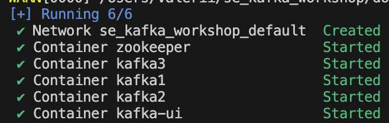
* Переходим в браузере по адресу localhost:8080
* Открывается интерфейс Kafka-UI
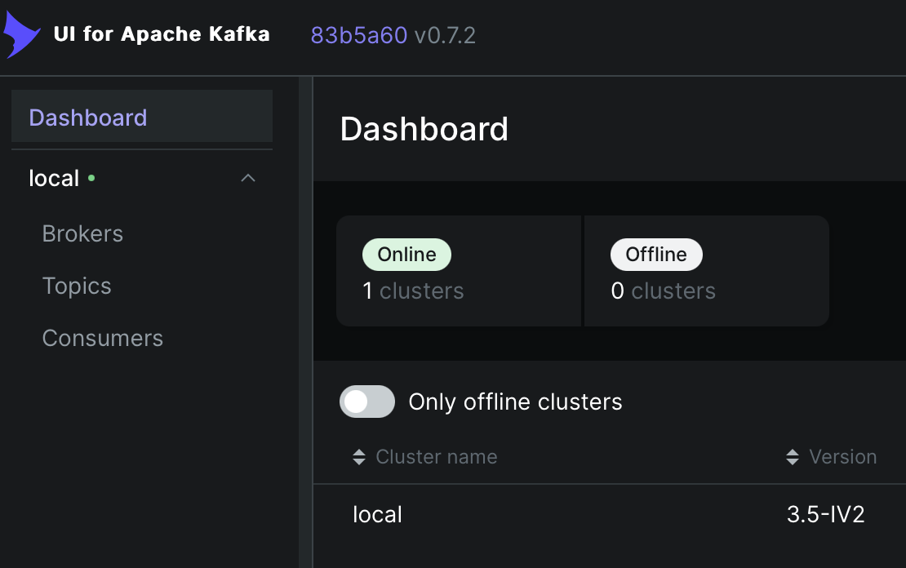
#### Создание топиков в Kafka-UI
Описано в [файле](./kafka-ui.md)
##### Задание
* Создайте с помощью KafkaUI топики
    * С 1 партицией и ограничением на время жизни сообщения в 2 минуты
        * Название – <инициалы + фамилия латинскими буквами>-topic-one-partition-time(vazubairov-topic-one-partition-time)
    * С 2 партициями и ограничением на размер топика в 100 байт
        * Название – <инициалы + фамилия латинскими буквами>-topic-one-partition-bytes(vazubairov-topic-one-partition-bytes)
    * С 3 партициями и произвольным названием
Дополнительно вы можете создать ещё несколько топиков с разными названиями для тренировки
#### Написание и работа с KafkaProducer
Описано в [файле](./kafka-producer.ipynb)
#### Написание и работа с KafkaConsumer
Описано в [файле](./kafka-consumer.ipynb)

### Итог работы


#### Работа с RabbitMQ Publisher
Описано в [файле](./rabbit-producer.ipynb)
#### Работа с RabbitMQ Consumer
Описано в [файле](./rabbit-consumer.ipynb)